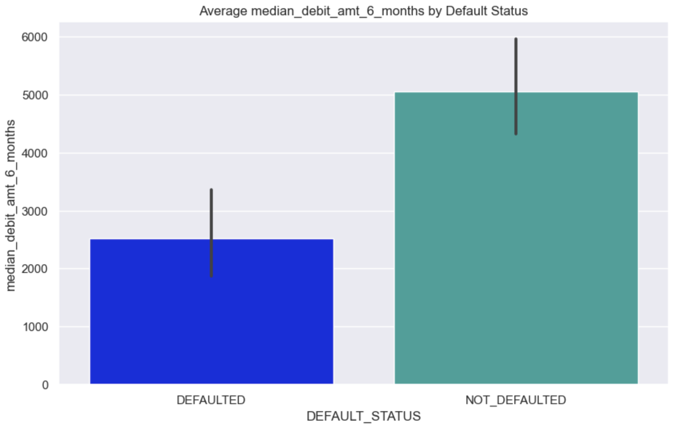

# credit-scoring-model

Analytics model to predict the probability a customer will default on loan repayment.

The aim is to have a model that can accurately predict probability of default on loan repayment in order to proactively take steps and measures to avert this.

Datasets(BLO3 & BLO5) are exclusive to loans data for the year 2022:

          1. Demographics
          2. Transactions
          3. Digital Channels
          4. Loans.
          
# Scope:
1. Ascertain potential Portfolio At Risk for loans disbursed to customers predicted to default.
2. Exploring the macro and micro level variables that predict the loan quality deterioration.
3. Using timely intervention to help minimise exposure to high-risk customers.

# Acceptance Criteria:
Acceptance will be determined by the business based on accuracy of the model upon experimentation. However, predictions churned out by the model MUST perform better than current system being used by business.

# Credit Scoring Approach

# Exploratory Data Analysis.

Exploratory Data Analysis (EDA) is an approach of analyzing data sets to summarize their main characteristics, often using statistical graphics and other data visualization methods as shown below:

### 2022 DATA -- PERFORMING VS NON-PERFORMING LOANS %

### AGE RANGE VS OTG

### AGE WITH BANK VS OTG

### NO. OF LOAN ACCOUNTS VS OTG

### NO. OF NON LOAN ACCOUNTS VS OTG

### AVERAGE MEDIAN CREDIT AMOUNT 6 MONTHS VS DEFAULT STATUS

### AVERAGE MEDIAN END OF DAY BALANCE 6 MONTHS VS DEFAULT STATUS

### AVERAGE MEDIAN DEBIT AMOUNT 6 MONTHS VS DEFAULT STATUS

### AVERAGE/MEDIAN CREDIT TO DEBIT AMOUNT RATIO VS DEFAUL STATUS

# CORRELATION HEATMAP
A correlation heatmap is a graphical tool that displays the correlation between multiple variables as a color-coded matrix. It's like a color chart 🌈 that shows us how closely related different variables are.

It displays the pairwise correlations between variables using color-coded cells, allowing for easy identification of relationships between variables.

Correlation measures the strength and direction of the linear relationship between two variables. It ranges from -1 to 1, with the sign indicating the direction of the relationship and the magnitude indicating the strength.

Positive correlation:

A positive correlation indicates that as one variable increases, the other variable tends to increase as well.
A correlation coefficient close to 1 indicates a strong positive correlation, meaning that the variables have a strong linear relationship and tend to move in the same direction

Negative correlation:

A negative correlation indicates that as one variable increases, the other variable tends to decrease.
A correlation coefficient close to -1 indicates a strong negative correlation, meaning that the variables have a strong linear relationship and tend to move in opposite directions.

Interpretation of correlation values:

A correlation coefficient close to 0 indicates a weak or no linear relationship between variables.
The closer the correlation coefficient is to -1 or 1, the stronger the relationship between variables.

A correlation coefficient of 0 indicates no linear relationship between the variables.
Correlation heat maps provide a visual summary of the relationships between variables in a dataset. They help in identifying patterns, dependencies, and potential multicollinearity issues.

## Multicollinearity
Multicollinearity refers to a situation in which two or more predictor variables in a regression model are highly correlated with each other. In other words, it is the presence of strong linear relationships among independent variables. Multicollinearity can cause issues in statistical analysis and interpretation, and it is important to understand its implications.

Explanation in terms of values:

1.High correlation coefficients: Multicollinearity is indicated by high correlation coefficients between predictor variables. Typically, correlation coefficients above 0.7 or 0.8 are considered to indicate strong multicollinearity. These high correlation values suggest that the variables are closely related and may provide redundant information.

2.Impact on coefficient estimates: Multicollinearity can lead to unstable and unreliable coefficient estimates. When predictor variables are highly correlated, it becomes difficult for the model to distinguish the individual effects of each variable. This results in coefficients that may have unexpected signs or magnitudes, making it challenging to interpret the relationship between predictors and the dependent variable accurately.

3.Increased standard errors: Multicollinearity inflates the standard errors of the regression coefficients. Larger standard errors imply reduced precision in estimating the true coefficients. Consequently, the t-statistics and p-values associated with the coefficients may be affected, making it difficult to determine the statistical significance of the variables.

4.Difficulty in interpreting variable importance: Multicollinearity complicates the interpretation of variable importance in the model. The presence of multicollinearity makes it challenging to identify the relative contribution of each predictor variable to the outcome variable accurately. It becomes unclear which variables are truly driving the relationship with the dependent variable.

5.Unstable model predictions: Multicollinearity can lead to unstable predictions. Small changes in the input variables can cause significant fluctuations in the predicted values. This instability can make it challenging to rely on the model for making accurate predictions or drawing reliable conclusions.

Addressing multicollinearity often involves one of the following approaches:

1.Removing one or more of the correlated variables from the model.
2.Combining or transforming correlated variables into a single variable.
3.Collecting additional data to reduce the correlation between variables.

By addressing multicollinearity, you can improve the stability, reliability, and interpretability of your model.
### VARIANCE INFLATION VALUES 

## VARIANCE INFLation FACTOR IN MULTICOLLINEARITY

Variance Inflation Factor (VIF) is a measure used to quantify the severity of multicollinearity in a regression analysis. It assesses how much the variance of the estimated regression coefficients is increased due to multicollinearity. VIF is calculated for each predictor variable in the regression model.

The formula to calculate the VIF for a predictor variable is as follows:

VIF = 1 / (1 - R²)

where R² represents the coefficient of determination obtained by regressing the predictor variable against all other predictor variables in the model.

Interpretation of VIF values:

VIF = 1: There is no multicollinearity. The predictor variable is not correlated with any other variables in the model.
VIF > 1 and VIF < 5: There is a moderate level of multicollinearity. It suggests that the predictor variable is correlated with other variables but not to a problematic extent.
VIF ≥ 5: There is a high level of multicollinearity. It indicates a strong correlation between the predictor variable and other variables, and it can cause instability and unreliable coefficient estimates in the regression model.
When examining VIF values, a commonly used rule of thumb is to consider VIF values above 5 as indicative of multicollinearity. However, the threshold can vary depending on the context and specific analysis.

Addressing multicollinearity based on VIF values:

If VIF values are high (e.g., above 5), it may be necessary to address multicollinearity by:
Removing one or more correlated variables from the model.
Transforming or combining variables to reduce their correlation.
Collecting more data to reduce the correlation between variables.
Using regularization techniques, such as ridge regression or lasso regression, that can handle multicollinearity effectively.
By assessing the VIF values, you can identify problematic levels of multicollinearity and take appropriate steps to mitigate its impact on the analysis.

## FEATURE ENGINEERING
Feature engineering is the process of creating new features or transforming existing features in a dataset to improve the performance of a machine learning model. It involves extracting meaningful information from raw data and representing it in a way that is more suitable for the learning algorithm.

Feature engineering plays a crucial role in machine learning because the quality and relevance of the input features directly impact the model's ability to learn and make accurate predictions. Here are some common techniques used in feature engineering:

1.Feature Extraction: It involves deriving new features from the existing ones to capture relevant information. This can include techniques such as:

  One-Hot Encoding: Converting categorical variables into binary vectors to represent different categories.

  Binning: Grouping continuous variables into bins or intervals to capture non-linear relationships.

  Date/Time Features: Extracting useful information from date or time variables, such as day, month, year, or time of day.

2.Feature Transformation: It involves applying mathematical transformations to the features to make them more suitable for the model. Some techniques include:

  Scaling: Standardizing or normalizing numerical features to ensure they are on similar scales.
  
  Logarithmic Transform: Applying logarithmic transformation to reduce the impact of outliers or skewness in data.
  
  Box-Cox Transform: Applying the Box-Cox transformation to stabilize variance and make the data more normally distributed.
  
3.Feature Interaction: Creating new features by combining or interacting existing features to capture complex relationships. Some methods include:

  Polynomial Features: Generating higher-order terms of existing features to capture non-linear relationships.
  
  Interaction Terms: Creating new features by multiplying or interacting two or more existing features.
  
4.Domain-Specific Feature Engineering: Incorporating domain knowledge to create features that are specific to the problem at hand. This can involve creating features based on business rules, heuristics, or expert knowledge.

5.Feature Selection: Identifying the most relevant features by using techniques such as statistical tests, feature importance from models, or dimensionality reduction methods like Principal Component Analysis (PCA).

It's important to note that feature engineering is an iterative process that requires domain knowledge, creativity, and experimentation. The effectiveness of feature engineering depends on understanding the data, the problem at hand, and the learning algorithm being used. Through careful feature engineering, you can improve model performance, reduce overfitting, and uncover hidden patterns in the data.

## FEATURE IMPORTANCE
Feature importance refers to the relative importance or contribution of each feature in a machine learning model towards making accurate predictions. It helps in understanding which features have the most significant impact on the model's performance and how they influence the target variable.

## CLASS IMBALANCE
Overall we addressed the class imbalance between the performing and non performing loans by oversampling the minority class(non performing loans) in the training data using the RandomOverSampler and SMOTE techniques, resulting in a more balanced dataset for training a machine learning model.

## MODEL PERFORMANCE ON THE 2022 TEST DATA
### RANDOM FOREST CLASSIFIER ALGORITHM

### LOGISTIC REGRESSION ALGORITHM

### XGBOOST CLASSIFIER

## MODEL VALIDATION ON 2023 DATA
We pickled our best model that is Random Forest Classifier to validate on 2023 loans data. The pickle file name is CS_JUN_2023.pkl

## MODEL FINE TUNING AND EVALUATION
Model fine-tuning refers to the process of making small adjustments or optimizations to a pre-trained machine learning model in order to improve its performance on a specific task or dataset. It involves tweaking various aspects of the model, such as hyperparameters, architecture, or training methodology, to achieve better results.

## MODEL DEPLOYMENT
